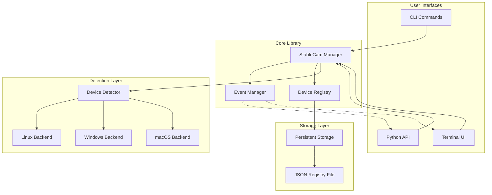

# Design Document

## Overview

StableCam is designed as a modular Python library with an optional TUI interface. The core architecture separates concerns between device detection, registry management, event handling, and user interfaces. The system uses a layered approach where platform-specific detection backends are abstracted behind a common interface, enabling cross-platform compatibility while maintaining clean separation of concerns.

## Architecture



## Components and Interfaces

### Core Components

#### StableCam Manager
The main orchestrator that coordinates all system components.

**Interface:**
```python
class StableCam:
    def detect() -> List[CameraDevice]
    def register(device: CameraDevice) -> str
    def list() -> List[RegisteredDevice]
    def get_by_id(stable_id: str) -> Optional[RegisteredDevice]
    def on(event_type: str, callback: Callable) -> None
    def run() -> None
    def stop() -> None
```

#### CameraDevice
Represents a detected USB camera with hardware identifiers.

**Interface:**
```python
@dataclass
class CameraDevice:
    system_index: int
    vendor_id: str
    product_id: str
    serial_number: Optional[str]
    port_path: Optional[str]
    label: str
    platform_data: Dict[str, Any]
```

#### RegisteredDevice
Represents a camera in the persistent registry with stable ID.

**Interface:**
```python
@dataclass
class RegisteredDevice:
    stable_id: str
    device_info: CameraDevice
    status: DeviceStatus
    registered_at: datetime
    last_seen: Optional[datetime]
```

#### Device Registry
Manages persistent storage and retrieval of registered devices.

**Interface:**
```python
class DeviceRegistry:
    def register(device: CameraDevice) -> str
    def get_all() -> List[RegisteredDevice]
    def get_by_id(stable_id: str) -> Optional[RegisteredDevice]
    def update_status(stable_id: str, status: DeviceStatus) -> None
    def find_by_hardware_id(device: CameraDevice) -> Optional[RegisteredDevice]
```

#### Device Detector
Abstracts platform-specific camera detection behind a common interface.

**Interface:**
```python
class DeviceDetector:
    def detect_cameras() -> List[CameraDevice]
    def get_platform_backend() -> PlatformBackend
```

### Platform Backends

Each platform backend implements camera detection using OS-specific APIs:

- **Linux Backend**: Uses `/dev/video*` enumeration with `v4l2` and `udev` for hardware info
- **Windows Backend**: Uses Windows Media Foundation or DirectShow APIs
- **macOS Backend**: Uses AVFoundation or IOKit for device enumeration

**Common Backend Interface:**
```python
class PlatformBackend:
    def enumerate_cameras() -> List[CameraDevice]
    def get_device_info(system_index: int) -> CameraDevice
```

### Event System

**Event Types:**
- `on_connect`: Fired when a registered device connects
- `on_disconnect`: Fired when a registered device disconnects  
- `on_status_change`: Fired when any device status changes

**Event Manager Interface:**
```python
class EventManager:
    def subscribe(event_type: str, callback: Callable) -> None
    def unsubscribe(event_type: str, callback: Callable) -> None
    def emit(event_type: str, data: Any) -> None
```

## Data Models

### Device Status Enumeration
```python
class DeviceStatus(Enum):
    CONNECTED = "connected"
    DISCONNECTED = "disconnected"
    ERROR = "error"
```

### Hardware Identifier Strategy
The system uses a hierarchical approach to generate stable IDs:

1. **Primary**: Serial number (if available)
2. **Secondary**: Vendor ID + Product ID + Port Path
3. **Fallback**: Vendor ID + Product ID + Hash of first detection timestamp

### Registry Storage Format
```json
{
    "version": "1.0",
    "devices": {
        "stable-cam-001": {
            "stable_id": "stable-cam-001",
            "vendor_id": "046d",
            "product_id": "085b",
            "serial_number": "ABC123456",
            "port_path": "/dev/usb1/1-1",
            "label": "Logitech C920 HD Pro Webcam",
            "status": "connected",
            "registered_at": "2024-01-15T10:30:00Z",
            "last_seen": "2024-01-15T14:22:00Z"
        }
    }
}
```

## Error Handling

### Device Detection Errors
- **Permission Errors**: Graceful degradation with user-friendly messages
- **Platform API Failures**: Fallback to alternative detection methods where possible
- **Hardware Access Errors**: Clear error reporting with troubleshooting guidance

### Registry Errors
- **File Corruption**: Automatic backup and recovery with user notification
- **Write Permissions**: Clear error messages with suggested solutions
- **Concurrent Access**: File locking to prevent corruption from multiple instances

### Event System Errors
- **Callback Exceptions**: Isolated error handling to prevent system-wide failures
- **Event Loop Errors**: Graceful recovery with logging and user notification

## Testing Strategy

### Unit Testing
- **Device Detection**: Mock platform backends for consistent testing across environments
- **Registry Operations**: Test with temporary registry files and various data scenarios
- **Event System**: Verify event firing and callback execution with mock subscribers
- **Hardware ID Generation**: Test identifier generation logic with various device configurations

### Integration Testing
- **Cross-Platform**: Automated testing on Linux, Windows, and macOS using CI/CD
- **Real Hardware**: Test with actual USB cameras when available in CI environment
- **Registry Persistence**: Verify data integrity across application restarts
- **Event Flow**: End-to-end testing of device connection/disconnection scenarios

### Performance Testing
- **Detection Speed**: Benchmark camera enumeration performance with multiple devices
- **Memory Usage**: Monitor memory consumption during long-running monitoring sessions
- **Event Latency**: Measure time between device state changes and event firing

### TUI Testing
- **Textual Framework**: Use Textual's built-in testing utilities for UI component testing
- **Display Accuracy**: Verify correct rendering of device information and status updates
- **User Interactions**: Test CLI command handling and TUI navigation

## Platform-Specific Implementation Details

### Linux Implementation
- Use `v4l2` for camera enumeration via `/dev/video*` devices
- Extract hardware info using `udev` library for vendor/product IDs and serial numbers
- Monitor device changes using `pyudev` for real-time detection

### Windows Implementation  
- Use `Windows Media Foundation` API for camera enumeration
- Extract device properties using `WMI` queries for hardware identifiers
- Monitor device changes using `WMI` event notifications

### macOS Implementation
- Use `AVFoundation` framework for camera discovery
- Extract hardware info using `IOKit` for USB device properties
- Monitor device changes using `IOKit` notifications

## Security Considerations

### File System Security
- Registry files stored in user-specific directories with appropriate permissions
- Input validation for all registry data to prevent injection attacks
- Secure handling of temporary files during registry updates

### Hardware Access Security
- Minimal required permissions for camera enumeration
- No actual camera access or data capture - only device metadata
- Clear documentation of required system permissions per platform